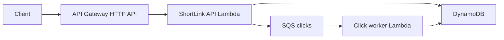

# ShortLink

A URL shortener that shows how a familiar Spring Boot 4 REST app runs on AWS Lambda.

The same `@RestController` beans run two ways:

- **Local:** `./mvnw spring-boot:run` (embedded Tomcat, in-memory store, clicks increment immediately)
- **Lambda:** `StreamLambdaHandler` turns API Gateway events into HTTP. Redirects enqueue SQS; `ClickEventHandler` increments DynamoDB

The commit-by-commit path is in [plan.md](plan.md).



## API

| Method | Path | Result |
|---|---|---|
| `GET` | `/health` | `200 {"status":"UP"}` |
| `POST` | `/links` | `{ "url": "https://..." }` → `201` with `code`, `shortUrl`, `originalUrl` |
| `GET` | `/r/{code}` | `302` to the original URL (records a click) |
| `GET` | `/links/{code}` | `200` stats: `originalUrl`, `createdAt`, `clickCount` |

Redirects live under `/r/` so they never collide with `/links` or `/health`. Short codes are 7-character base62, generated **per request**.

On AWS, `clickCount` can lag the redirect by a short time (SQS is async). Locally it updates immediately.

## Prerequisites

- Java 21
- [AWS SAM CLI](https://docs.aws.amazon.com/serverless-application-model/latest/developerguide/install-sam-cli.html) for `sam build` / `sam deploy`
- Docker for `./mvnw test` (DynamoDB Local via Testcontainers) and `sam local invoke`
- An IAM user with programmatic access for deploy (not the account root)

The Maven wrapper (`./mvnw`) is committed, so a local Maven install is optional.

## Run locally

The default profile is `local`. No AWS credentials or DynamoDB required.

```bash
./mvnw test
./mvnw spring-boot:run
```

```bash
curl localhost:8080/health
curl -sS -X POST localhost:8080/links -H 'Content-Type: application/json' \
  -d '{"url":"https://example.com"}'
curl -sSI localhost:8080/r/<code>
curl localhost:8080/links/<code>
```

## Package and invoke locally as Lambda

Spring Boot's executable jar puts classes under `BOOT-INF/`, which Lambda cannot load as a handler. `./mvnw package` also builds `target/shortlink-aws.jar` with classes at the jar root.

```bash
./mvnw -DskipTests package
sam build
sam local invoke ShortlinkFunction --event events/health.json
```

`SkipBuild: true` in `template.yaml` tells SAM to use that jar instead of compiling Java itself.

One API Lambda serves every HTTP route (`/{proxy+}` and `/`). Spring MVC routes inside the process. HTTP API **payload format 1.0** matches `AwsProxyRequest`. Format 2.0 would not.

`/health` works without DynamoDB. Create/redirect/stats in AWS need the table and queue.

## Deploy

First time (creates `samconfig.toml`):

```bash
./mvnw -DskipTests package
sam build
sam deploy --guided
```

Later:

```bash
./mvnw -DskipTests package
sam build
sam deploy
```

The first SnapStart deploy can take several minutes: Lambda starts Spring, snapshots memory, then publishes version `live`.

Tear down when you are done (stops Lambda / API Gateway / DynamoDB / SQS charges):

```bash
sam delete --stack-name sam-app
```

## Test in AWS

```bash
sam list stack-outputs --stack-name sam-app --output table
```

Copy `ApiEndpoint` (no trailing slash). Do **not** use `curl -L` on the redirect; you want the 302.

```bash
API="https://xxxxxxxx.execute-api.us-east-2.amazonaws.com"

curl -sS "$API/health"

curl -sS -X POST "$API/links" -H 'Content-Type: application/json' \
  -d '{"url":"https://example.com"}'

CODE="paste-the-code"
curl -sSI "$API/r/$CODE"
curl -sS "$API/links/$CODE"
# retry stats until clickCount is 1
```

| Symptom | Where to look |
|---|---|
| `/health` fails | API Gateway / Lambda integration; `sam logs --stack-name sam-app --name ShortlinkFunction` |
| `POST /links` is 500 | `TABLE_NAME` or DynamoDB IAM |
| Redirect works, `clickCount` stays 0 | worker: `sam logs --stack-name sam-app --name ClickWorkerFunction --tail` |

After SnapStart has finished snapshotting, a **cold** invoke `REPORT` line should show `Restore Duration` (hundreds of ms), not a multi-second `Init Duration`. `$LATEST` never uses SnapStart; the HTTP API uses alias `live`.

## Two Lambdas, one jar

| Function | Handler | Trigger | Role |
|---|---|---|---|
| `ShortlinkFunction` | `StreamLambdaHandler` (Spring MVC) | HTTP API | Create, redirect, stats |
| `ClickWorkerFunction` | `ClickEventHandler` (plain `RequestHandler`) | SQS | `ADD clickCount :one` |

The API Lambda should return 302 quickly. It does not increment DynamoDB on the request path.

## SnapStart

Java + Spring is slow to boot. SnapStart snapshots the initialized JVM and restores it on later cold starts.

Do **not** freeze into the snapshot: unique IDs, secrets, open connections. This app generates codes per request, reseeds `SecureRandom` on restore, and rebuilds DynamoDB/SQS clients on restore (CRaC `afterRestore`).

GraalVM native can start even faster; it is a heavier build. This example stays on SnapStart.

## When not to put Spring Boot on Lambda

This pattern fits spiky HTTP APIs and event workers. Prefer ECS/Fargate, App Runner, or EC2 when:

- You need long-lived connections (RDS/Hikari connection pools, WebSockets, gRPC streams)
- The app is a large monolith; even SnapStart restore plus a fat jar is the wrong cost model
- Traffic is high and steady 24/7, so always-on compute is cheaper than per-invoke Lambda
- Every request must be well under SnapStart restore time and you do not want Provisioned Concurrency

DynamoDB (IAM, no pool) fits Lambda. RDS usually does not, unless you add something like RDS Proxy and accept the extra moving parts.

## What each commit taught

| Step | Commit | Lesson |
|---|---|---|
| 0 | `docs: add commit-by-commit plan and gitignore` | Plan and ignore editor/build junk before code |
| 1 | `chore: scaffold Spring Boot 4 app with health endpoint` | This is still a normal Boot app (Boot 4 uses `starter-webmvc`) |
| 2 | `feat: add in-memory create, redirect, and stats API` | Controller / service / repository so storage can change later |
| 3 | `feat: proxy API Gateway events through Serverless Java Container` | Same controllers; static handler = cold start vs warm invoke |
| 4 | `build: package the app as a SAM Lambda with HTTP API` | Shade jar (not `BOOT-INF`); one function, Spring routes |
| 5 | `feat: persist links in DynamoDB` | Why not RDS; `local` vs `lambda` profiles |
| 6 | `perf: enable SnapStart and make init snapshot-safe` | `$LATEST` ignores SnapStart; reseed RNG; rebuild clients |
| 7 | `feat: record clicks asynchronously with SQS` | HTTP Lambda vs event Lambda |
| 8 | this README | How to run it, and when not to |
