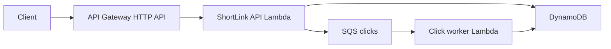

# ShortLink: Spring Boot on AWS Lambda (commit-by-commit)

A small URL shortener that teaches how a familiar Spring Boot REST app runs on Lambda. Each step is one commit. After each step we stop so you can read the diff, run the tests, and ask questions before the next change.

## What you will have at the end

- `POST /links` creates a short code for a URL
- `GET /r/{code}` redirects and records a click
- `GET /links/{code}` returns stats
- The **same** Spring Boot app runs locally (`./mvnw spring-boot:run`) and on Lambda
- API Gateway HTTP API in front of Lambda
- DynamoDB for storage
- SnapStart for cold starts
- An SQS click pipeline as a second, event-driven function



## Stack choices (and why)

| Choice | Pick | Why |
|---|---|---|
| Language | Java 21 | LTS, first-class Lambda runtime, SnapStart is well documented |
| Framework | Spring Boot 4.1.x | Current supported line (3.5 OSS ended June 2026) |
| Lambda HTTP adapter | [AWS Serverless Java Container](https://github.com/aws/serverless-java-container) 3.0.2 (`aws-serverless-java-container-springboot4`) | Keeps `@RestController`; this is the migration path most teams actually want |
| Infra | AWS SAM (`template.yaml`) | The lingua franca of Lambda tutorials; `sam local` is useful later |
| Data | DynamoDB | Stateless, no connection pool, the store that fits Lambda |
| Build | Maven wrapper | Matches official AWS Spring Boot samples |

We are **not** starting with Spring Cloud Function, GraalVM, or RDS. Those are good follow-ups; they would bury the first lesson (Spring MVC on Lambda).

## API (stable from step 2)

| Method | Path | Result |
|---|---|---|
| `GET` | `/health` | `200 { "status": "UP" }` |
| `POST` | `/links` | body `{ "url": "https://..." }` → `201` with `code`, `shortUrl`, `originalUrl` |
| `GET` | `/r/{code}` | `302` to the original URL |
| `GET` | `/links/{code}` | `200` stats (`originalUrl`, `createdAt`, `clickCount`) |

Redirects live under `/r/` so they never collide with `/links` or `/health`.

Short codes are 7-character base62, generated **per request** with `SecureRandom` — never in a static initializer. That matters once SnapStart restores a snapshot.

## How we will work

1. I implement **one step**.
2. I run the tests for that step.
3. I make **one git commit** with the message listed below.
4. I stop and summarize what changed and what to look at.
5. You review. When you say to continue, we do the next step.

Nothing in steps 1–4 needs an AWS account. Deploy shows up in step 5.

## Commit plan

### Step 0 — Plan and gitignore (do this first)
**Commit:** `docs: add commit-by-commit plan and gitignore`

Put the working plan in the repo and ignore editor junk before any app code.

- `plan.md` (this file, at the repo root)
- `.gitignore`: IntelliJ (`.idea/`, `*.iml`), VS Code (`.vscode/`, `*.code-workspace`, `.history/`), plus `target/` and OS files so later Maven output is not committed

**You should be able to:** open `plan.md` in the repo; `.idea/` and `.vscode/` stay untracked.

**Look at:** the eight application steps below. Application code starts at step 1.

---

### Step 1 — Spring Boot skeleton
**Commit:** `chore: scaffold Spring Boot 4 app with health endpoint`

Empty app → a runnable local Spring Boot process.

- Maven wrapper, `pom.xml` (Java 21, Spring Boot 4.1.x, `spring-boot-starter-web`, `spring-boot-starter-test`)
- `ShortlinkApplication`
- `GET /health`
- One MockMvc test
- README with how to run locally

**You should be able to:** `./mvnw test` and `./mvnw spring-boot:run`, then `curl localhost:8080/health`.

**Look at:** project layout, Boot 4 parent POM, why this is still a normal Spring Boot app.

---

### Step 2 — In-memory ShortLink API
**Commit:** `feat: add in-memory create, redirect, and stats API`

The product, with no AWS yet.

- `Link` + `LinkService` + `LinkRepository` (in-memory `ConcurrentHashMap`)
- `LinkController` with validation (`@NotBlank`, URL format)
- 404 when the code is unknown
- Tests: create → redirect → stats; validation errors; missing code

**You should be able to:** create a link, follow the 302, read `clickCount: 1`.

**Look at:** controller vs service vs repository. This layering is what lets us swap DynamoDB in later without rewriting HTTP.

---

### Step 3 — Lambda HTTP adapter
**Commit:** `feat: proxy API Gateway events through Serverless Java Container`

Same controllers, now also invokable as a Lambda.

- Dependency `aws-serverless-java-container-springboot4` 3.0.2
- `StreamLambdaHandler` implementing `RequestStreamHandler`, Spring context built **once** in a static block (cold start vs warm invoke)
- Sample API Gateway proxy event under `events/`
- Test that feeds a fake `GET /health` event into the handler and asserts the JSON body

Keep Tomcat so `./mvnw spring-boot:run` still works. Dual-runtime is the point.

**You should be able to:** run the existing MockMvc tests **and** the new handler test. No AWS.

**Look at:** why the handler is static; how an API Gateway JSON event becomes an HTTP request; `MAIN_CLASS` / `getAwsProxyHandler(Application.class)`.

---

### Step 4 — SAM template and Lambda zip
**Commit:** `build: package the app as a SAM Lambda with HTTP API`

Infra as code, still no cloud deploy required.

- `template.yaml`: Java 21, HttpApi catch-all, handler `StreamLambdaHandler::handleRequest`, 1024 MB, 20s timeout
- Maven shade (or assembly zip) so `sam build` has a fat artifact
- Exclude nothing essential yet; we can slim later
- README: `sam build` / `sam local invoke` with the sample event

**You should be able to:** `./mvnw -DskipTests package` and `sam build`. Optional: `sam local invoke` if Docker is available.

**Look at:** `AWS::Serverless::Function` + `HttpApi` event; `CodeUri`; why one Lambda serves every route (the container does routing, not API Gateway method mapping).

---

### Step 5 — DynamoDB persistence
**Commit:** `feat: persist links in DynamoDB`

Replace the map with a table. Local tests use Testcontainers (`amazon/dynamodb-local`). A `local` Spring profile keeps the in-memory repo so `spring-boot:run` still works without AWS.

- Table `ShortLinks`: PK `code`, attributes `originalUrl`, `createdAt`, `clickCount`
- AWS SDK v2 DynamoDB client, created as a Spring bean (init-once, reuse on warm invokes)
- Atomic `ADD clickCount :one` on redirect
- SAM: table resource, `DynamoDBCrudPolicy`, `TABLE_NAME` env var
- README: `sam deploy --guided` and curl against the API Gateway URL

**You should be able to:** tests pass with Testcontainers. Deploy is optional here; we can do it together if you have AWS credentials.

**Look at:** why not RDS/Hikari on Lambda; env-based table name; repository swap via Spring profile.

---

### Step 6 — SnapStart
**Commit:** `perf: enable SnapStart and make init snapshot-safe`

The Java-on-Lambda lesson.

- `SnapStart: ApplyOn: PublishedVersions` and `AutoPublishAlias: live` (SnapStart only applies to published versions, not `$LATEST`)
- CRaC / SnapStart notes: codes generated per request; no secrets or unique IDs baked into static state
- Optional priming hook only if it stays small
- README: how to read `Init Duration` vs `Restore Duration` in CloudWatch

**You should be able to:** read the template change and the uniqueness comments. Deploy to *see* restore times is optional.

**Look at:** why `$LATEST` ignores SnapStart; what is unsafe to do at class-init; SnapStart vs GraalVM (we stay on SnapStart).

---

### Step 7 — Async click pipeline
**Commit:** `feat: record clicks asynchronously with SQS`

Second Lambda style: events, not HTTP.

- Redirect enqueues `{ code, clickedAt }` instead of incrementing inline
- SQS queue + worker function (can be a small Spring Cloud Function **or** a dedicated handler in the same repo — we will pick the smaller option when we get here)
- Worker does the DynamoDB increment
- Stats may lag by milliseconds — that is the lesson

**You should be able to:** create a link, redirect, eventually see `clickCount` rise.

**Look at:** HTTP Lambda vs event Lambda; why the API function should not do extra work on the redirect path; IAM for SQS + DynamoDB.

---

### Step 8 — README and operator notes
**Commit:** `docs: explain architecture, local vs Lambda, and when not to use this`

- Architecture diagram
- Local / SAM local / deploy paths
- What each commit taught
- When Spring Boot on Lambda is a bad fit (long-lived connections, huge apps, steady 24/7 traffic that is cheaper on ECS)

## Out of scope (later, if you want)

- GraalVM native custom runtime
- RDS / Spring Data JPA
- Auth
- Custom domains / HTTPS extras
- CI deploy pipeline

## Files we will grow into

```
pom.xml
template.yaml
README.md
events/health.json
src/main/java/com/example/shortlink/
  ShortlinkApplication.java
  StreamLambdaHandler.java
  api/          # controllers + request/response records
  domain/       # Link, LinkService
  persistence/  # repository + DynamoDB impl
  events/       # SQS click worker (step 7)
src/test/java/...
```

No extra modules. One app, two entry points (`main` and the Lambda handler).
